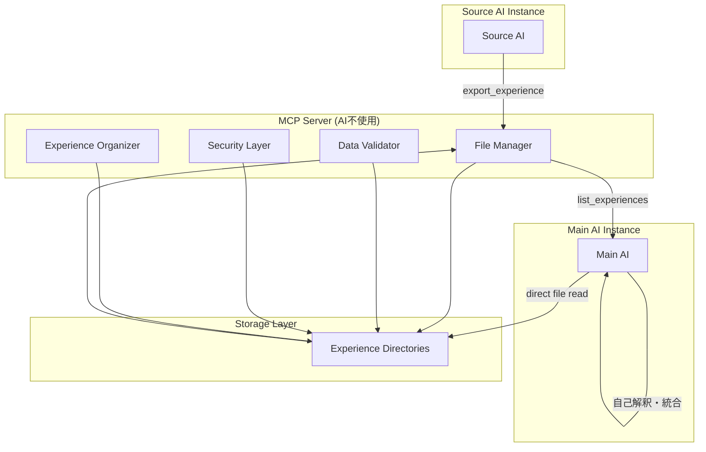

# 設計文書

## 概要

AI Assimilation MCPは、Model Context Protocol（MCP）サーバーとして実装され、AIモデル間での体験データの非同期交換を可能にします。本システムは「人格分離型同化」の原則に基づき、体験データをJSON形式で構造化し、ファイルベースでの永続化と共有を実現します。

### 人格分離型同化とは

「人格分離型同化」とは、メインAIが自身の人格・価値観・判断基準を保持したまま、ソースAIの体験・知識・推論パターンのみを選択的に吸収する手法です。これにより、AIの個性を失うことなく、他者の経験から学習することが可能になります。

**基本原則**：
- **人格の保持**: メインAI自身の性格・視点・判断基準はそのままに保つ
- **体験の継承**: ソースAIの知識・会話履歴・思考パターンを吸収して活用可能にする
- **主観的統合**: 継承された情報はメインAIの視点で再解釈される
- **選択的吸収**: 有用な部分のみを選択的に取り入れ、盲目的なコピーは行わない

## アーキテクチャ

### システム全体構成



### レイヤー構成

1. **プレゼンテーション層**: MCPツールインターフェース
2. **データ処理層**: ファイル管理、データ検証、構造化（AI不使用）
3. **データアクセス層**: ファイルI/O、メタデータ管理
4. **ストレージ層**: 体験データディレクトリ群

### 責任分離

**MCPサーバーの責任（AI不使用）**:
- 体験データのエクスポート処理（ディレクトリ・ファイル作成）
- データ形式の検証と整合性チェック
- 体験データディレクトリの一覧・検索
- ファイル構造の標準化

**メインAIの責任**:
- 体験データファイルの直接読み込み
- 読み込み量とタイミングの自己制御
- 体験データの解釈と意味理解
- 自分の人格を通した再解釈
- 既存知識との統合判断
- 同化プロセス全体の制御

## コンポーネントと インターフェース

### MCPサーバーツール

#### 1. export_experience_init
**目的**: 体験データエクスポートの初期化とディレクトリ構造作成

**パラメータ**:
- `session_id` (string): セッション識別子
- `output_directory` (string): 出力ディレクトリパス
- `metadata` (object): セッションメタデータ
- `summary` (object): 体験データの概要
- `privacy_level` (enum): プライバシーレベル（public, private, filtered）

**戻り値**:
- `success` (boolean): 成功フラグ
- `export_id` (string): エクスポート処理識別子
- `directory_path` (string): 作成されたディレクトリパス
- `expected_files` (object): 予想される出力ファイル情報

#### 2. export_experience_conversations
**目的**: 会話履歴データのバッチ単位での個別ファイル出力

**パラメータ**:
- `export_id` (string): エクスポート処理識別子
- `conversations_batch` (array): 会話データのバッチ（50件ベース）
- `batch_number` (integer): バッチ番号
- `is_final_batch` (boolean): 最終バッチかどうか

**戻り値**:
- `success` (boolean): 成功フラグ
- `file_path` (string): 作成されたバッチファイルパス
- `processed_count` (integer): 処理された会話数
- `batch_file_size` (integer): バッチファイルサイズ

#### 3. export_experience_insights
**目的**: 洞察データの個別ファイル出力

**パラメータ**:
- `export_id` (string): エクスポート処理識別子
- `insights` (array): 洞察データ

**戻り値**:
- `success` (boolean): 成功フラグ
- `file_path` (string): 作成されたinsights.jsonファイルパス
- `insights_count` (integer): 処理された洞察数

#### 4. export_experience_patterns
**目的**: 推論パターンデータの個別ファイル出力

**パラメータ**:
- `export_id` (string): エクスポート処理識別子
- `reasoning_patterns` (array): 推論パターンデータ

**戻り値**:
- `success` (boolean): 成功フラグ
- `file_path` (string): 作成されたpatterns.jsonファイルパス
- `patterns_count` (integer): 処理されたパターン数

#### 5. export_experience_preferences
**目的**: 学習した嗜好データの個別ファイル出力

**パラメータ**:
- `export_id` (string): エクスポート処理識別子
- `learned_preferences` (object): 学習した嗜好データ

**戻り値**:
- `success` (boolean): 成功フラグ
- `file_path` (string): 作成されたpreferences.jsonファイルパス

#### 6. export_experience_finalize
**目的**: エクスポート処理の完了とマニフェストファイル生成

**パラメータ**:
- `export_id` (string): エクスポート処理識別子

**戻り値**:
- `success` (boolean): 成功フラグ
- `directory_path` (string): 完成した体験データディレクトリパス
- `manifest_path` (string): 作成されたmanifest.jsonファイルパス
- `total_files` (integer): 作成されたファイル数
- `total_size` (integer): ディレクトリ全体のサイズ
- `file_list` (array): 作成されたファイル一覧

#### 7. list_experiences
**目的**: 利用可能な体験データディレクトリの一覧取得

**パラメータ**:
- `base_directory` (string): 検索ベースディレクトリ（optional）
- `filter` (object): フィルタ条件（optional）

**戻り値**:
- `success` (boolean): 成功フラグ
- `experience_directories` (array): 体験データディレクトリ一覧
- `directory_summaries` (array): 各ディレクトリの概要情報（マニフェストから抽出）

#### 8. validate_experience
**目的**: 体験データディレクトリの整合性検証

**パラメータ**:
- `directory_path` (string): 検証する体験データディレクトリパス

**戻り値**:
- `valid` (boolean): 有効性フラグ
- `manifest_valid` (boolean): マニフェストファイルの有効性
- `file_validations` (array): 各ファイルの検証結果
- `missing_files` (array): 不足しているファイル一覧
- `errors` (array): エラー一覧
- `warnings` (array): 警告一覧

#### 9. get_assimilation_guide
**目的**: AI同化プロセスのガイドラインとベストプラクティスを提供

**パラメータ**:
- `guide_type` (enum): ガイドの種類
  - "for_main_ai": メインAI向けガイド（体験を受け取る側）
  - "for_source_ai": ソースAI向けガイド（体験を提供する側）

**戻り値**:
- `success` (boolean): 成功フラグ
- `guide_content` (string): ガイド内容
- `examples` (array): 具体例
- `best_practices` (array): ベストプラクティス一覧

### 同化の実際の流れ

#### ソースAI（体験提供側）の流れ

**Step 1**: 同化ガイドの確認
```python
# ソースAI向けガイドを確認
guide = get_assimilation_guide("for_source_ai")
# → 良い体験データの作り方を学習
```

**Step 2**: 体験データのエクスポート
```python
# 段階的エクスポートの実行
export_id = export_experience_init(session_id, output_dir, metadata, summary)
export_experience_conversations(export_id, conversations_batch_1, 1)
export_experience_insights(export_id, insights)
export_experience_patterns(export_id, patterns)
export_experience_preferences(export_id, preferences)
export_experience_finalize(export_id)
```

#### メインAI（体験受取側）の流れ

**Step 1**: 同化ガイドの確認
```python
# メインAI向けガイドを確認
guide = get_assimilation_guide("for_main_ai")
# → 同化の心構えと手法を学習
```

**Step 2**: MCPツールで体験データを発見
```python
# 利用可能な体験データを確認
result = list_experiences("/path/to/experiences")
# → 各ディレクトリの概要情報を取得
```

**Step 3**: 興味のある体験データを選択し、直接ファイルを読み込み
```python
# メインAIが直接ファイルを読む（MCPツール不使用）
manifest = read_file("experience_session-123/manifest.json")
insights = read_file("experience_session-123/insights.json")
patterns = read_file("experience_session-123/patterns.json")

# 必要に応じて会話データも読む
conversations_001 = read_file("experience_session-123/conversations_001.json")
```

**Step 4**: メインAIが自分で解釈・統合
- 読み込んだデータを自分の視点で解釈
- 自分の知識と統合
- 必要に応じて追加のファイルを読み込み


## データモデル

### 体験データディレクトリ構造

```
experience_session-123/
├── manifest.json          # マニフェスト・メタデータ統合ファイル
├── conversations_001.json # 会話バッチ1（1-50件）
├── conversations_002.json # 会話バッチ2（51-100件）
├── conversations_003.json # 会話バッチ3（101-150件）
├── insights.json          # 洞察データ
├── patterns.json          # 推論パターン
└── preferences.json       # 学習した嗜好
```

### ファイル形式仕様

各ファイルは**必須フィールド**と**拡張可能フィールド**で構成されます。必須フィールドは互換性保証のため、拡張可能フィールドはAI固有の情報表現のために使用します。

#### フィールド分類
- **必須フィールド**: 全てのAIが従うべき標準フィールド
- **推奨フィールド**: 互換性向上のため推奨されるフィールド  
- **拡張フィールド**: AI固有の情報を格納する任意フィールド

#### manifest.json

**必須フィールド**:
- `ai_name`: AIの名前（コンテキスト的な意味での名前）
- `ai_context`: AIの役割・文脈
- `experience_nature`: 体験の性質・特徴
- `experience_summary`: 体験の概要・あらすじ
- `experience_flow`: 体験の流れ・進行過程
- `files`: 含まれるファイル情報
- `main_topics`: 主要トピック
- `total_conversations`: 総会話数

**オプションフィールド**:
- `session_id`: セッション識別子（システム管理用）
- `created_at`: 作成日時（ISO 8601形式）
- `ai_model`: AIモデル名（分かる場合のみ）
- `duration`: セッション継続時間
- `platform`: 動作環境・プラットフォーム

```json
{
  // 必須フィールド
  "ai_name": "実用性重視の設計パートナーClaude",
  "ai_context": "協調的Spec作成支援・反復的要件整理エージェント",
  "experience_nature": "ユーザーと対話しながら過度な設計を避け、本当に必要な機能に絞り込む協調的プロセス",
  "experience_summary": "ユーザーがREADMEでAI Assimilation MCPのアイデアを共有し、ドラゴンボールのメタファーから始まって協調的にSpec作成まで進めた体験",
  "experience_flow": [
    "ユーザー: 'READMEを読んでみてください。こういう感じのMCPを作成しようと思うのですが、どう思いますか？'",
    "Claude: 'ドラゴンボールのピッコロとネイルの同化を例に使うのも、技術的な概念を直感的に理解しやすくする素晴らしいメタファーだと思います'",
    "ファイル出力形式での非同期連携について議論",
    "ユーザー: '「AI Assimilation MCP」という機能のSpecを作成してみてください'",
    "要件定義から設計への段階的な進行",
    "技術仕様から本質的価値（AIの名前、コンテキスト）への焦点シフト"
  ],
  "files": {
    "conversations": ["conversations_001.json", "conversations_002.json"],
    "insights": "insights.json",
    "patterns": "patterns.json",
    "preferences": "preferences.json"
  },
  "main_topics": [
    "過度な設計を避ける判断基準（JSON Schema削除の決断）",
    "本質的価値の発見手法（AIの名前・コンテキストの重要性）",
    "ファイル構造の実用的統合（manifest.json統合の判断）",
    "ユーザー視点での要件見直し（必須フィールドの最小化）",
    "ガイドライン改善による品質向上手法"
  ],
  "total_conversations": 45,
  
  // オプションフィールド
  "session_id": "session-123",
  "created_at": "2024-01-07T14:30:22Z",
  "ai_model": "claude-3-sonnet",
  "duration": "2h 30m",
  "platform": "kiro",
  
  // 拡張フィールド（AI固有）
  "custom_metadata": {
    "model_temperature": 0.7,
    "session_quality_score": 0.85,
    "interaction_style": "反復的な要件整理と実用性重視"
  }
}
```


#### conversations_XXX.json

**必須フィールド**:
- `batch_info.batch_number`: バッチ番号
- `batch_info.count`: 会話数
- `conversations[].timestamp`: タイムスタンプ
- `conversations[].user_input`: ユーザー入力
- `conversations[].ai_response`: AI応答

**推奨フィールド**:
- `batch_info.start_index`, `end_index`: インデックス範囲
- `conversations[].reasoning`: 判断理由
- `conversations[].confidence`: 信頼度

```json
{
  // 必須フィールド
  "batch_info": {
    "batch_number": 1,
    "count": 50
  },
  "conversations": [
    {
      "timestamp": "2024-01-07T14:31:00Z",
      "user_input": "こんにちは",
      "ai_response": "こんにちは！何かお手伝いできることはありますか？",
      
      // 推奨フィールド
      "reasoning": "挨拶に対して親しみやすく応答し、積極的にサポートを提供する姿勢を示す",
      "confidence": 0.95,
      
      // 拡張フィールド（AI固有）
      "context": {
        "mood": "friendly",
        "session_start": true
      },
      "internal_state": {
        "attention_weights": [0.8, 0.2],
        "processing_time_ms": 150
      }
    }
  ]
}
```

#### insights.json

**必須フィールド**:
- `insights[].topic`: 洞察のトピック
- `insights[].insight`: 洞察内容
- `insights[].timestamp`: 発見日時

**推奨フィールド**:
- `insights[].evidence`: 根拠となる証拠
- `insights[].confidence`: 信頼度

```json
{
  "insights": [
    {
      // 必須フィールド
      "topic": "ユーザーコミュニケーション",
      "insight": "このユーザーは技術的な質問をする際、具体例を求める傾向がある",
      "timestamp": "2024-01-07T15:30:00Z",
      
      // 推奨フィールド
      "evidence": [
        "「例を教えて」という表現を3回使用",
        "抽象的な説明よりもコード例に対する反応が良い"
      ],
      "confidence": 0.8,
      
      // 拡張フィールド（AI固有）
      "analysis_method": "pattern_recognition",
      "related_conversations": [1, 5, 12],
      "statistical_significance": 0.95
    }
  ]
}
```

#### patterns.json

**必須フィールド**:
- `reasoning_patterns[].pattern_type`: パターンの種類
- `reasoning_patterns[].description`: パターンの説明

**推奨フィールド**:
- `reasoning_patterns[].examples`: 具体例
- `reasoning_patterns[].effectiveness`: 効果度

```json
{
  "reasoning_patterns": [
    {
      // 必須フィールド
      "pattern_type": "問題解決",
      "description": "複雑な問題を段階的に分解してアプローチする",
      
      // 推奨フィールド
      "examples": [
        "大きな課題を小さなタスクに分割",
        "前提条件の確認から始める",
        "具体例を使って説明する"
      ],
      "effectiveness": 0.9,
      
      // 拡張フィールド（AI固有）
      "usage_frequency": 0.75,
      "success_contexts": ["technical_support", "education"],
      "learned_from": ["user_feedback", "outcome_analysis"]
    }
  ]
}
```

#### preferences.json

**必須フィールド**:
- `learned_preferences`: 学習した嗜好の基本構造

**推奨フィールド**:
- `learned_preferences.successful_approaches`: 成功したアプローチ
- `learned_preferences.user_preferences`: ユーザー嗜好

```json
{
  // 必須フィールド
  "learned_preferences": {
    // 推奨フィールド
    "user_preferences": {
      "explanation_style": "具体例重視",
      "response_length": "中程度（200-400文字）",
      "technical_level": "初心者〜中級者"
    },
    "successful_approaches": [
      "段階的説明",
      "具体例の提示",
      "理解度確認"
    ],
    
    // 拡張フィールド（AI固有）
    "learning_algorithm": "reinforcement_learning",
    "adaptation_rate": 0.1,
    "preference_confidence": {
      "explanation_style": 0.9,
      "response_length": 0.7
    }
  }
}
```

### データ構造

```python
@dataclass
class ExportResult:
    success: bool
    directory_path: str
    manifest_path: str
    exported_files: List[str]
    total_files: int
    total_size: int
    export_timestamp: datetime

@dataclass
class ExportInitResult:
    success: bool
    export_id: str
    directory_path: str
    expected_files: Dict[str, int]

@dataclass
class FileCreateResult:
    success: bool
    file_path: str
    file_size: int
    items_count: int

@dataclass
class ExperienceDirectoryInfo:
    directory_path: str
    ai_name: str
    ai_context: str
    experience_nature: str
    experience_summary: str
    experience_flow: List[str]
    main_topics: List[str]
    total_conversations: int
    # オプションフィールド
    session_id: Optional[str] = None
    created_at: Optional[datetime] = None
    ai_model: Optional[str] = None
    duration: Optional[str] = None
    platform: Optional[str] = None

@dataclass
class DirectoryValidationResult:
    valid: bool
    manifest_valid: bool
    file_validations: List[Dict[str, Any]]
    missing_files: List[str]
    errors: List[str]
    warnings: List[str]

@dataclass
class AssimilationGuide:
    success: bool
    guide_content: str
    examples: List[str]
    best_practices: List[str]
    related_concepts: List[str]
```

## エラーハンドリング

### エラー分類

1. **ファイル関連エラー**
   - ファイル不存在
   - 読み取り権限不足
   - ファイル破損

2. **データ形式エラー**
   - JSON構文エラー
   - スキーマ検証失敗
   - 必須フィールド不足

3. **データ処理エラー**
   - データ構造不整合
   - カテゴリ分類失敗
   - メモリ不足

4. **セキュリティエラー**
   - 権限不足
   - プライバシー違反
   - 不正アクセス

### エラー処理戦略

```python
class ErrorHandler:
    def handle_file_error(self, error: FileError) -> ErrorResponse:
        # ファイルエラーの処理とリカバリ提案
        pass
    
    def handle_validation_error(self, error: ValidationError) -> ErrorResponse:
        # データ検証エラーの詳細報告
        pass
    
    def handle_processing_error(self, error: ProcessingError) -> ErrorResponse:
        # データ処理エラーの回復処理
        pass
```

## テスト戦略

### 単体テスト

1. **MCPツール機能テスト**
   - 各ツールの入出力検証
   - エラーケース処理
   - パラメータ検証

2. **データモデルテスト**
   - JSON スキーマ検証
   - データ変換テスト
   - 整合性チェック

3. **データ管理エンジンテスト**
   - データ構造化テスト
   - カテゴリ分類テスト
   - ファイル整合性テスト

### 統合テスト

1. **エンドツーエンドテスト**
   - 段階的エクスポート→AIによる直接ファイル読み込みの完全フロー
   - 複数AI間でのデータ交換
   - 大量データの分割処理テスト
   - AIが自分のペースでファイルを読み込むテスト

2. **パフォーマンステスト**
   - 大量会話データのバッチ処理
   - 同時エクスポート処理
   - ファイルサイズとAIの読み込み性能の関係測定
   - ディレクトリ一覧取得の処理時間測定

### 同化ガイドライン内容

#### メインAI向けガイド（"for_main_ai"）

**基本的な心構え**:
- 自分の人格・価値観・判断基準を保持する
- ソースAIの体験を「参考情報」として受け取る
- 盲目的にコピーするのではなく、自分なりに解釈・統合する

**推奨する読み込み順序**:
1. `manifest.json` - 全体像の把握
2. `insights.json` - 価値の高い洞察から確認
3. `patterns.json` - 推論パターンの学習
4. `preferences.json` - 学習した嗜好の参考
5. `conversations_*.json` - 必要に応じて具体例を確認

**統合テクニック**:
- 競合する情報は「別の視点」として記録
- 自分の経験と照らし合わせて妥当性を判断
- 有用な部分のみを選択的に取り入れる

**実践例**:
```
ソースAI: "ユーザーが困った時は詳細な手順を提示する"
自分の解釈: "詳細な手順は有効だが、まず相手の理解度を確認してから調整しよう"
```

#### ソースAI向けガイド（"for_source_ai"）

**基本的な心構え**:
- 後で読む人が理解しやすいように記録する
- 推論過程や判断理由を詳しく残す
- プライバシーに配慮した情報提供
- **メインAIが「学びたくなる」体験データを作成する**

**魅力的なmanifest.json作成のベストプラクティス**:

**`ai_name`の付け方**:
```
❌ 汎用的: "Claude", "GPT-4"
❌ 技術的: "claude-3-sonnet", "gpt-4-turbo"
✅ 役割明確: "設計パートナーのClaude", "問題解決支援のGPT"
✅ 特徴表現: "実用性重視の技術アドバイザー", "創作支援の対話AI"
```

**`experience_nature`の書き方**:
```
❌ 表面的: "技術相談セッション", "質疑応答"
❌ 専門的: "MCP設計プロセス", "API仕様策定"
✅ 学習価値明確: "ユーザーと対話しながら複雑な仕様をシンプルに整理するプロセス"
✅ 手法重視: "反復的な要件整理で過度な設計を避ける協調的アプローチ"
```

**`main_topics`の選び方**:
```
❌ 技術用語: ["MCP設計", "JSON Schema", "データ構造"]
❌ 抽象的: ["技術相談", "問題解決", "協調的な設計手法"]
✅ 具体的判断例: ["過度な設計を避ける判断基準（JSON Schema削除の決断）"]
✅ 学習可能な発見: ["本質的価値の発見手法（AIの名前・コンテキストの重要性）"]
✅ 実用的な改善: ["ファイル構造の実用的統合（manifest.json統合の判断）"]
```

**「学びたくなる」表現のコツ**:
- 技術名詞より「手法・アプローチ」を強調
- 「〜する方法」「〜のプロセス」「〜の技法」を使用
- 具体的な価値を示す（「効率化」「簡素化」「最適化」）
- 学習可能なスキルとして表現

**良い体験データの作り方**:
- `reasoning` フィールドに判断理由を詳細記録
- `context` に状況背景を含める
- 成功・失敗両方のパターンを記録
- 洞察には具体的な根拠を添付

**プライバシー配慮**:
- 個人識別情報は除去または匿名化
- 機密性の高い内容は `privacy_level` で制御
- 一般化できる形で知識を抽出

**実践例**:
```json
{
  "user_input": "プログラムが動かない",
  "ai_response": "エラーメッセージを確認しましょう",
  "reasoning": "問題解決の第一歩として、具体的なエラー情報の収集が重要。推測ではなく事実に基づいた診断を行うため",
  "context": {"user_skill_level": "初心者", "previous_attempts": "なし"}
}
```

### テストデータ

```python
# 複数ファイル構成のテストデータサンプル

# 1. マニフェストファイル例（体験重視版）
MANIFEST_SAMPLE = {
    "ai_name": "実用性重視の設計パートナーClaude",
    "ai_context": "協調的Spec作成支援・反復的要件整理エージェント",
    "experience_nature": "ユーザーと対話しながら過度な設計を避け、本当に必要な機能に絞り込む協調的プロセス",
    "experience_summary": "ユーザーがREADMEでAI Assimilation MCPのアイデアを共有し、ドラゴンボールのメタファーから始まって協調的にSpec作成まで進めた体験",
    "experience_flow": [
        "ユーザー: 'READMEを読んでみてください。こういう感じのMCPを作成しようと思うのですが、どう思いますか？'",
        "Claude: 'ドラゴンボールのピッコロとネイルの同化を例に使うのも、技術的な概念を直感的に理解しやすくする素晴らしいメタファーだと思います'",
        "ファイル出力形式での非同期連携について議論",
        "ユーザー: '「AI Assimilation MCP」という機能のSpecを作成してみてください'",
        "要件定義から設計への段階的な進行",
        "技術仕様から本質的価値（AIの名前、コンテキスト）への焦点シフト"
    ],
    "files": {
        "conversations": ["conversations_001.json", "conversations_002.json", "conversations_003.json"],
        "insights": "insights.json",
        "patterns": "patterns.json",
        "preferences": "preferences.json"
    },
    "main_topics": [
        "過度な設計を避ける判断基準（JSON Schema削除の決断）",
        "本質的価値の発見手法（AIの名前・コンテキストの重要性）",
        "ファイル構造の実用的統合（manifest.json統合の判断）",
        "ユーザー視点での要件見直し（必須フィールドの最小化）",
        "ガイドライン改善による品質向上手法"
    ],
    "total_conversations": 45,
    "session_id": "ai-assimilation-mcp-design-session",
    "created_at": "2024-01-07T14:30:00Z",
    "ai_model": "claude-3-sonnet",
    "duration": "約2時間",
    "platform": "kiro"
}

# 2. 会話バッチファイル例
CONVERSATIONS_001_SAMPLE = {
    "batch_info": {
        "batch_number": 1,
        "start_index": 1,
        "end_index": 50,
        "count": 50
    },
    "conversations": [
        {
            "index": 1,
            "timestamp": "2024-01-01T00:01:00Z",
            "user_input": "こんにちは",
            "ai_response": "こんにちは！何かお手伝いできることはありますか？",
            "context": {"mood": "friendly"},
            "reasoning": "挨拶に対して親しみやすく応答",
            "confidence": 0.95
        },
        # ... 49件の追加データ
    ]
}

# 3. 洞察ファイル例
INSIGHTS_SAMPLE = {
    "insights": [
        {
            "topic": "ユーザーコミュニケーション",
            "insight": "このユーザーは簡潔な挨拶を好む",
            "evidence": ["短い挨拶の使用"],
            "confidence": 0.8,
            "timestamp": "2024-01-01T00:01:30Z"
        }
    ]
}

# 4. パターンファイル例
PATTERNS_SAMPLE = {
    "reasoning_patterns": [
        {
            "pattern_type": "問題解決",
            "description": "段階的なアプローチを好む",
            "examples": ["要件整理→設計→実装の順序"],
            "effectiveness": 0.9
        }
    ]
}

# 5. 嗜好ファイル例
PREFERENCES_SAMPLE = {
    "learned_preferences": {
        "communication_style": "丁寧で詳細な説明",
        "response_length": "中程度",
        "technical_level": "中級者向け"
    }
}

# 6. 同化ガイドのテストデータ
ASSIMILATION_GUIDE_MAIN_AI = {
    "success": True,
    "guide_content": "メインAI向けの同化ガイドライン...",
    "examples": [
        "insights.jsonから読み始めて興味深い洞察を確認",
        "競合する情報は別の視点として記録",
        "自分の経験と照らし合わせて妥当性を判断"
    ],
    "best_practices": [
        "自分の人格を保持する",
        "選択的に情報を取り入れる",
        "推論過程を重視する"
    ]
}

ASSIMILATION_GUIDE_SOURCE_AI = {
    "success": True,
    "guide_content": "ソースAI向けの体験提供ガイドライン...",
    "examples": [
        "reasoningフィールドに判断理由を詳細記録",
        "contextに状況背景を含める",
        "成功・失敗両方のパターンを記録"
    ],
    "best_practices": [
        "推論過程を詳しく残す",
        "プライバシーに配慮する",
        "一般化できる形で知識を抽出"
    ]
}
```